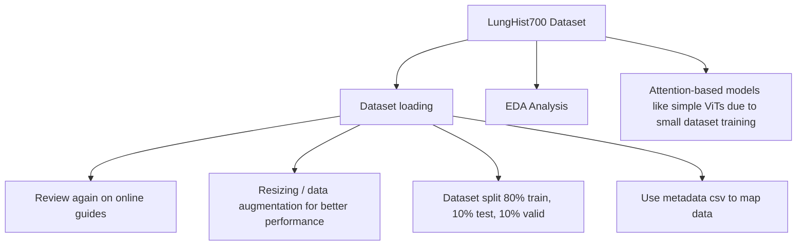

# digipath 

### Problem definition

Why apply digital pathology analysis instead of MRI for tumors? 

Whole-slide images provides morphological biomarkers (tissue ROIs) and cellular resolution,
capturing finer details of each tissue sample over subjective visual indicators from MRIs.
Giving more precise insights to cancer / tumor diagnosis and grading in AI/ML applications.

Digital pathology is proven to improve workflows by 13% and clear return on investments (ROIs), 
establishing cost advantage over traditional MRI consultations and providing lab revenue.

[(Wilson et al., 2017)](https://clpmag.com/diagnostic-technologies/digital-pathology/digital-pathology-gives-rise-computational-pathology/)

## Todo

Goal : Create a strong-level / patch-level WSI (Whole-Slide Image) lung tumor Classification with good results

> i know this is keywordy but bare with me mister

- [ ] Create pytorch ImageFolder dataset over LungHist700 dataset. Refer the target class based on the paper. (Data Loading)
    - [x] LungHist700 file path labeling
    - [ ] Conduct patient-wise strategy ensuring that images from the same patient were placed
in the same set to ensure fair evaluation and prevent data leakage.

    - "The DNN model used in both methods was a ResNet50 network pretrained on ImageNet. The Adam optimizer was employed with an initial learning rate of 1e-5, which was reduced by a factor of 0.1 if the model began to overfit. Categorical cross-entropy was used as the loss function in both experiments. The Albumentations library25 was utilized to generate augmentations on the fly during training."

    - resizing / data augmentation for better performance
    - dataset split 80% train, 10% test, 10% valid

- [ ] EDA analysis (?)

- [ ] Attention-based models like simple ViTs due to small dataset training

#### Future ideas

> MIL can only be used on weak-level / slide-level / world-level supervised learning

- Find WSI dataset, preprocess into patches and create feature vectors with pre-trained CNNs. Performing weak-level (slide-level) classification
    - Based on CLAM architecture with flask evaluation visualization
- Tissue segmentation 

### Dataset Description

- [TCIA Rectum Cancer / TCGA-READ](https://www.cancerimagingarchive.net/collection/tcga-read/)

- LungHist700 [(Diosdado et al., 2024)](https://doi.org/10.1038/s41597-024-03944-3)
    - "Accurate detection and classification of lung malignancies are crucial for 
    early diagnosis, treatment planning, and patient prognosis." 
    - "... a dataset of 691 high-resolution (1200 × 1600 pixels) histopathological lung images, covering adenocarcinomas, squamous cell carcinomas, and normal tissues from 45 patients. These images are subdivided into three differentiation levels for both pathological types: well, moderately, and poorly differentiated, resulting in seven classes for classification. The dataset includes images at 20x and 40x magnification, reflecting real clinical diversity. "

### Pipeline 

Due to the large pixel resolution, we divide the WSI into smaller pixel samples [(224x224 pixels is recommended)](https://www.reddit.com/r/computervision/comments/o6f1y9/whole_slide_image_wsi_classification_with_vision/). We used an expert-labeled segmented dataset, which skips slide-level preprocessing as each patches are needed to be thoroughly examined by real pathologists. 

.. (under construction)

### Dataset Setup 

Download the dataset [online](https://figshare.com/articles/dataset/LungHist700_A_Dataset_of_Histological_Images_for_Deep_Learning_in_Pulmonary_Pathology/25459174), extract it and place onto the `data/` folder for analysis.

## References

- Gul, A. G., Cetin, O., Reich, C., Flinner, N., Prangemeier, T., & Koeppl, H. (2022). Histopathological image classification based on self-supervised vision transformer and weak labels. Medical Imaging 2022: Digital and Computational Pathology, 57. https://doi.org/10.1117/12.2624609 [(link)](https://arxiv.org/abs/2210.09021)

- nghihuynh. (2022, August 10). MayoClinic: WSI preprocessing + Tiling. Kaggle.com; Kaggle. [(link)](https://www.kaggle.com/code/nghihuynh/mayoclinic-wsi-preprocessing-tiling)

